# Polaris Insights Multi-Platform Bot

A multi-platform bot that fetches insights from Polaris API and posts them to **Telegram** or **Twitter** with custom image generation and overlays.


## 🚀 Platform Support

This bot supports parallel deployment to multiple platforms:

- **🔵 Telegram** - Channel/group posting with rich media support
- **🐦 Twitter** - Tweet posting with image attachments
- **⚡ Parallel Deployment** - Run separate instances for each platform

## Features

✨ **Custom Image Generation** - Creates 1200x630 OG images with colored backgrounds and overlays  
🎯 **Smart Overlays** - Polaris logo and token images with configurable positioning  
🔄 **Token Support** - Extracts token logos from new API format (`subjectValue.logoImgURL`)  
⭕ **Circular Tokens** - Configurable circular clipping for professional token display  
📱 **Responsive Scaling** - Configurable foreground image scaling (default: 70% of height)  
🎨 **Color Management** - Uses `colors.json` for consistent brand colors  
🚀 **Modular Architecture** - Clean, maintainable codebase with utility modules  
⚡ **Dual Caching** - ID-based and timestamp-based duplicate prevention  
🧪 **Test Mode** - Separate test environment with isolated caches  
🔀 **Multi-Platform** - Single codebase supports both Telegram and Twitter
📊 **Twitter Integration** - OAuth 1.0a authentication with media upload support  

## Image Generation

The bot creates custom images based on insight background types:

### Color Backgrounds
- Generates 1200x630 images with brand colors from `colors.json`
- Centers foreground graphics with configurable scaling
- Applies Polaris logo overlay (top-left, 80x80px, 40px margins)
- Adds token image overlays (bottom-right, overlapping layout)

### Image Backgrounds  
- Downloads and scales background images to 1200x630
- Applies same overlay system (logo + tokens)
- Supports both direct image URLs and graphics URLs

### Overlay System
- **Polaris Logo**: 80x80px, top-left corner, 40px from edges
- **Token Images**: 80x80px, bottom-right, 50% overlap, circular clipping
- **Configurable**: All overlays can be toggled via environment variables

## How it works

```mermaid
flowchart TD
    A[🤖 Bot Starts] --> B[📡 Fetch Latest Insights from Polaris API]
    B --> C[� Reverse to Chronological Order - Oldest First]
    C --> D[⏰ Filter by Minimum Age - Skip Recent Insights]
    D --> E{📝 Any Eligible Insights?}
    E -->|No| F[✅ Nothing to Send]
    E -->|Yes| G[� Check Processed IDs Cache]
    G --> H{🆔 Already Processed?}
    H -->|Yes| I[⏭️ Skip Insight]
    H -->|No| J[📅 Check Timestamp Cache - Optional Optimization]
    J --> K{🖼️ Determine Background Type}
    K -->|Image/Graphics| L[📸 Send Photo Message]
    K -->|Color Background| M[🎨 Create Custom Image with Canvas]
    K -->|No Background| N[💬 Send Text Message]
    M --> L
    L --> O[✅ Message Sent Successfully]
    N --> O
    O --> P[💾 Update Processed IDs Cache]
    P --> Q[📝 Update Timestamp Cache]
    Q --> R[⏱️ Wait 1 Second - Rate Limiting]
    R --> S{� More Insights?}
    S -->|Yes| G
    S -->|No| T[🎉 Done]
    I --> S
    F --> T
```



## Message Types

The bot sends different types of messages based on the insight's background configuration:

```mermaid
graph TD
    A[📄 Insight] --> B{� Background Type}
    B -->|image| C[📸 Photo Message<br/>Image URL + Caption]
    B -->|color| D[🎨 Custom Image Creation]
    B -->|none/invalid| E[💬 Text Message<br/>Headline + Link]
    
    D --> F{🖼️ Has Visualization PNG?}
    F -->|Yes| G[🎨 Canvas: Color Background<br/>+ Centered PNG Overlay]
    F -->|No| H[❌ Error - Fallback to Text]
    
    G --> I[📸 Photo Message<br/>Custom Image + Caption]
    H --> E
    
    style C fill:#e1f5fe
    style I fill:#fff3e0
    style E fill:#f3e5f5
```



### Message Details

- **🖼️ Image Background**: Uses `backgroundValue` URL directly, or `visualizationValue` if `visualizationType` is "graphics"
- **🎨 Color Background**: Creates custom image using Canvas - colored background from `colors.json` with centered PNG overlay from `visualizationValue`
- **💬 Text Only**: When no valid background is available, sends headline with "Read more" link

## Quick Setup

### 1. Install Dependencies
```bash
npm install
```

### 2. Choose Platform and Configure

#### For Telegram:
```env
PLATFORM_MODE=telegram
TELEGRAM_TOKEN=your_bot_token_here
TELEGRAM_CHAT_ID=your_chat_id_here
```

#### For Twitter:
```env
PLATFORM_MODE=twitter
TWITTER_API_KEY=your_api_key_here
TWITTER_API_SECRET=your_api_secret_here
TWITTER_ACCESS_TOKEN=your_access_token_here
TWITTER_ACCESS_TOKEN_SECRET=your_access_token_secret_here
```

### 3. Run the Bot
```bash
npm start
```

## Platform Configuration

### Telegram Setup

1. **Create a bot** with [@BotFather](https://t.me/botfather)
2. **Get your chat ID** - Forward a message from your channel to [@RawDataBot](https://t.me/rawdatabot)
3. **Configure environment**:
   ```env
   PLATFORM_MODE=telegram
   TELEGRAM_TOKEN=123456789:ABCdefGHIjklMNOpqrsTUVwxyz
   TELEGRAM_CHAT_ID=-1001234567890
   ```

### Twitter Setup

1. **Create a Twitter Developer Account** at [developer.twitter.com](https://developer.twitter.com)
2. **Create a new App** and generate API keys
3. **Configure environment**:
   ```env
   PLATFORM_MODE=twitter
   TWITTER_API_KEY=your_25_character_api_key
   TWITTER_API_SECRET=your_50_character_api_secret
   TWITTER_ACCESS_TOKEN=your_50_character_access_token
   TWITTER_ACCESS_TOKEN_SECRET=your_45_character_access_token_secret
   TWITTER_POST_IMAGES=true
   ```

### Parallel Deployment

To run both platforms simultaneously, deploy separate instances:

```bash
# Instance 1: Telegram
cp .env.template .env.telegram
# Configure PLATFORM_MODE=telegram in .env.telegram

# Instance 2: Twitter  
cp .env.template .env.twitter
# Configure PLATFORM_MODE=twitter in .env.twitter

# Run both instances
node index.js --env-file=.env.telegram &
node index.js --env-file=.env.twitter &
```

Or use different directories:
```bash
# Directory 1: Telegram bot
cd /deploy/polaris-telegram/
# Configure for Telegram
node index.js

# Directory 2: Twitter bot  
cd /deploy/polaris-twitter/
# Configure for Twitter
node index.js
```

## Configuration

### Platform Selection
```env
# Required: Choose your platform
PLATFORM_MODE=telegram  # or 'twitter'
```

### Telegram Settings (when PLATFORM_MODE=telegram)
```env
TELEGRAM_TOKEN=your_telegram_bot_token_here
TELEGRAM_CHAT_ID=your_chat_id_here
TELEGRAM_TEST_CHAT_ID=your_test_chat_id_here
TEST_MODE=false
DISABLE_WEB_PAGE_PREVIEW=true
```

### Twitter Settings (when PLATFORM_MODE=twitter)
```env
TWITTER_API_KEY=your_twitter_api_key_here
TWITTER_API_SECRET=your_twitter_api_secret_here
TWITTER_ACCESS_TOKEN=your_twitter_access_token_here
TWITTER_ACCESS_TOKEN_SECRET=your_twitter_access_token_secret_here
TWITTER_POST_IMAGES=true
```

### Universal Settings (both platforms)
```env
# Test mode configuration
TEST_MODE=false

# API configuration
POLARIS_API_URL=https://api.polaris.app
POLARIS_INSIGHTS_URL=https://beta.polaris.app/insights/

# Bot behavior
INSIGHTS_LIMIT=7
MINIMUM_AGE_MINUTES=10
DEFAULT_BACKGROUND_COLOR=gray-900

# Image generation settings
SCALE_FOREGROUND_IMAGE=0.7
OVERLAY_POLARIS_LOGO=true
OVERLAY_TOKEN_LOGO=true
CIRCULAR_CLIP_TOKEN_LOGO=true

# Caching
MAX_PROCESSED_IDS=200
```

### Twitter-Specific Notes

- **Character Limit**: Tweets are automatically truncated to fit Twitter's 280-character limit
- **URL Shortening**: Twitter automatically shortens URLs (reserves 23 characters)
- **Image Format**: Supports PNG/JPG images up to 5MB
- **Rate Limits**: Built-in 1-second delay between posts
- **OAuth 1.0a**: Uses HMAC-SHA1 signature for authentication

### Image Configuration Details

- **`SCALE_FOREGROUND_IMAGE`**: Scale factor for foreground graphics (0.1-2.0, default: 0.7)
- **`OVERLAY_POLARIS_LOGO`**: Enable/disable Polaris logo overlay (default: true)
- **`OVERLAY_TOKEN_LOGO`**: Enable/disable token image overlays (default: true)  
- **`CIRCULAR_CLIP_TOKEN_LOGO`**: Make token images circular (default: true)
- **`DEFAULT_BACKGROUND_COLOR`**: Fallback color when requested color not found

## Testing

### Telegram Instance (Every 15 Minutes)
```bash
crontab -e
# Add this line:
*/15 * * * * cd /path/to/polaris-telegram && node index.js
```

### Twitter Instance (Every 30 Minutes)
```bash
crontab -e
# Add this line:
*/30 * * * * cd /path/to/polaris-twitter && node index.js
```

### Parallel Deployment with PM2
```bash
# Install PM2
npm install -g pm2

# Start Telegram instance
cd /deploy/polaris-telegram
pm2 start ecosystem.config.js --name polaris-telegram

# Start Twitter instance  
cd /deploy/polaris-twitter
pm2 start ecosystem.config.js --name polaris-twitter

# Monitor both instances
pm2 list
pm2 logs
```

### Example PM2 Ecosystem File
```javascript
// ecosystem.config.js
module.exports = {
  apps: [{
    name: 'polaris-insights',
    script: 'index.js',
    cron_restart: '*/15 * * * *',
    autorestart: false,
    env: {
      NODE_ENV: 'production'
    }
  }]
}
```

## Caching System

The bot uses a dual cache system to prevent duplicates and optimize performance:


### Cache Files

- **`processed_insights.cache.json`**: Stores up to 200 insight IDs with metadata (primary duplicate protection)
- **`latest_insight.cache.json`**: Stores last processed timestamp (secondary optimization)
- **Test Mode**: Uses prefixed cache files (`test_*.cache.json`) when `TEST_MODE=true`

## Dependencies

- `dotenv` - Environment variables
- `node-fetch` - API requests  
- `js-console-log-colors` - Colored console output
- `canvas` - Image processing and custom image generation
- `form-data` - Multipart form uploads (Telegram photo messages)
- `twitter-api-v2` - Twitter API v2 client with OAuth 1.0a support

## Twitter API Requirements

- **Twitter Developer Account** required
- **Basic API access** sufficient for posting
- **OAuth 1.0a** authentication (automatically handled)
- **Rate limits**: 300 tweets per 15-minute window (more than sufficient)

## Troubleshooting

### Twitter API Issues
```bash
# Check Twitter credentials
curl -X GET "https://api.twitter.com/2/tweets/me" -H "Authorization: Bearer YOUR_BEARER_TOKEN"

# Test tweet posting
PLATFORM_MODE=twitter node index.js
```

### Platform Selection Issues  
```bash
# Verify platform mode
echo $PLATFORM_MODE

# Check configuration
node -e "console.log(require('./utils/config.js').config.platform.mode)"
```

## Testing

The bot includes comprehensive testing capabilities for both platforms.

### Quick Test (Recommended)
```bash
# Ensure TEST_MODE=true in .env file
npm start
```
This will run the bot in test mode using test credentials and isolated cache files.

### Test Configuration
When `TEST_MODE=true`:
- Uses `TELEGRAM_TEST_CHAT_ID` instead of production chat
- Uses `TWITTER_TEST_*` credentials if available
- Creates separate cache files prefixed with `test_`
- Safe to run without affecting production

### Verification Checklist
- ✅ API connectivity to Polaris
- ✅ Image generation with Canvas
- ✅ Token logo extraction and overlays
- ✅ Platform-specific message formatting
- ✅ Cache system functionality
- ✅ Error handling and fallbacks

## License

MIT
